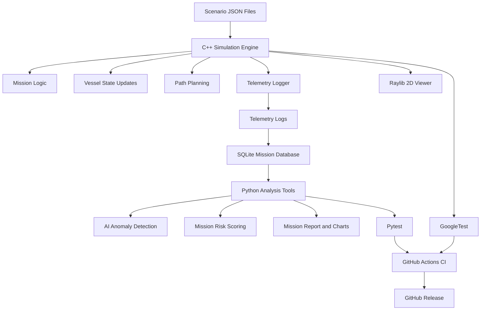

# MaritimeOpsSim Architecture

## High-Level Architecture

```text
Scenario JSON
    ↓
C++ Simulation Engine
    ↓
Raylib 2D Viewer
    ↓
Telemetry Logs
    ↓
SQLite Mission Database
    ↓
Python AI / Analysis Tools
    ↓
Mission Reports / Charts
    ↓
GitHub Actions CI
    ↓
GitHub Release / Downloadable Build
```

## Architecture Sketch



## Main C++ Modules

| Module                | Responsibility                                                            |
| --------------------- | ------------------------------------------------------------------------- |
| `SimulationEngine`    | Runs the main simulation loop and coordinates all systems                 |
| `Mission`             | Stores mission state, objectives, success rules, and failure rules        |
| `Vessel`              | Represents USV position, speed, heading, battery, and signal status       |
| `PathPlanner`         | Calculates routes using BFS and A\*                                       |
| `MapGrid`             | Represents the 2D map, obstacles, restricted zones, and search areas      |
| `ScenarioLoader`      | Loads mission data from JSON files                                        |
| `TelemetryLogger`     | Records vessel state, mission events, and alerts                          |
| `CommunicationSystem` | Simulates signal strength, heartbeat, delay, and communication loss       |
| `AlertManager`        | Generates alerts for low battery, route deviation, and communication loss |
| `MissionScorer`       | Calculates mission success, response time, and mission score              |
| `RaylibRenderer`      | Draws the 2D maritime simulation UI                                       |

## Main Python Modules

| Module                 | Responsibility                                   |
| ---------------------- | ------------------------------------------------ |
| `generate_scenario.py` | Creates or modifies mission scenario files       |
| `analyze_mission.py`   | Reads mission logs and summarizes results        |
| `detect_anomalies.py`  | Detects abnormal telemetry patterns              |
| `risk_score.py`        | Calculates mission risk level                    |
| `generate_report.py`   | Generates post-mission reports and charts        |
| `replay_mission.py`    | Replays mission events from logs                 |
| `batch_run.py`         | Runs multiple scenarios for testing and analysis |

## Data Flow

1. A user selects or creates a scenario JSON file.
2. The C++ simulation engine loads the scenario.
3. The simulation engine updates vessel state over time.
4. Raylib displays the mission visually.
5. Telemetry and mission events are logged.
6. SQLite stores mission data.
7. Python tools analyze the mission data.
8. AI tools detect anomalies and calculate risk.
9. Reports and charts summarize the mission.
10. GitHub Actions builds and tests the project.
11. A release package is created for download.

## Safety Boundary

MaritimeOpsSim is designed only for safe search-and-rescue, maritime domain awareness, telemetry analysis, and software engineering education.

The system does not include weapon targeting, missile guidance, fire-control logic, strike planning, attack optimization, or real-world tactical recommendations.
