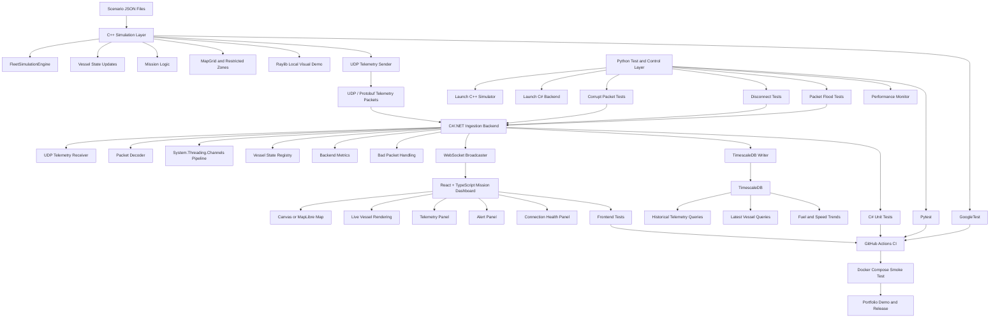

# MaritimeOpsSim Architecture

## Project Identity

**MaritimeOpsSim — Distributed Maritime Command & Telemetry Platform**

MaritimeOpsSim is a safe distributed maritime simulation and telemetry platform focused on search-and-rescue, maritime domain awareness, vessel telemetry, mission monitoring, real-time dashboard visualization, time-series persistence, automated fault-injection testing, and resilient distributed systems.

The project started as a C++/Raylib unmanned surface vessel simulator and is now being expanded into a multi-layer distributed telemetry platform.

---

## High-Level Architecture

```text
Scenario JSON
    ↓
C++ Simulation Layer
    - Fleet simulation
    - Vessel physics loop
    - Position, heading, speed, fuel, signal state
    - Local Raylib visual demo
    - UDP telemetry emitter
    ↓
UDP / Protobuf Telemetry
    ↓
C#/.NET Ingestion Layer
    - UDP listener
    - Protocol Buffers decoder
    - System.Threading.Channels pipeline
    - Vessel state registry
    - WebSocket broadcaster
    - TimescaleDB writer
    ↓
WebSocket Stream
    ↓
React + TypeScript Presentation Layer
    - Live mission dashboard
    - Canvas or MapLibre rendering
    - 100 moving vessel icons
    - Telemetry panel
    - Alerts and connection health
    ↓
TimescaleDB
    - Time-series telemetry storage
    - Latest vessel queries
    - Historical trend queries
    ↓
Python Test & Control Layer
    - Launch automation
    - Corrupt packet injection
    - Socket disconnect tests
    - Packet flood tests
    - Performance monitoring
    - Pytest verification
    ↓
Docker / Linux Runtime
    - Multi-container local deployment
    - CI-ready architecture
```

---

## Architecture Sketch


```mermaid
flowchart TD
    A[Scenario JSON Files] --> B[C++ Simulation Layer]

    B --> C[FleetSimulationEngine]
    B --> D[Vessel State Updates]
    B --> E[Mission Logic]
    B --> F[MapGrid and Restricted Zones]
    B --> G[Raylib Local Visual Demo]
    B --> H[UDP Telemetry Sender]

    H --> I[UDP / Protobuf Telemetry Packets]

    I --> J[C#/.NET Ingestion Backend]
    J --> K[UDP Telemetry Receiver]
    J --> L[Packet Decoder]
    J --> M[System.Threading.Channels Pipeline]
    J --> N[Vessel State Registry]
    J --> O[Backend Metrics]
    J --> P[Bad Packet Handling]
    J --> Q[WebSocket Broadcaster]
    J --> R[TimescaleDB Writer]

    Q --> S[React + TypeScript Mission Dashboard]
    S --> T[Canvas or MapLibre Map]
    S --> U[Live Vessel Rendering]
    S --> V[Telemetry Panel]
    S --> W[Alert Panel]
    S --> X[Connection Health Panel]

    R --> Y[TimescaleDB]
    Y --> Z[Historical Telemetry Queries]
    Y --> AA[Latest Vessel Queries]
    Y --> AB[Fuel and Speed Trends]

    AC[Python Test and Control Layer] --> AD[Launch C++ Simulator]
    AC --> AE[Launch C# Backend]
    AC --> AF[Corrupt Packet Tests]
    AC --> AG[Disconnect Tests]
    AC --> AH[Packet Flood Tests]
    AC --> AI[Performance Monitor]

    AF --> J
    AG --> J
    AH --> J

    B --> AJ[GoogleTest]
    J --> AK[C# Unit Tests]
    S --> AL[Frontend Tests]
    AC --> AM[Pytest]

    AJ --> AN[GitHub Actions CI]
    AK --> AN
    AL --> AN
    AM --> AN

    AN --> AO[Docker Compose Smoke Test]
    AO --> AP[Portfolio Demo and Release]
```

---

## Layer Responsibilities

## 1. C++ Simulation Layer

The C++ layer is the source of truth for simulated vessel behavior.

Responsibilities:

- Load scenario JSON files
- Maintain mission state
- Maintain vessel runtime state
- Update vessel position, speed, heading, fuel, and signal state
- Simulate search-and-rescue and maritime domain awareness scenarios
- Detect restricted-zone conditions
- Support local Raylib visualization
- Produce telemetry records
- Emit telemetry over UDP
- Eventually serialize telemetry using Protocol Buffers

Primary modules:

| Module                   | Responsibility                                                     |
| ------------------------ | ------------------------------------------------------------------ |
| `SimulationEngine`       | Runs the original simulation loop and coordinates mission systems  |
| `FleetSimulationEngine`  | Updates many vessel states in a deterministic fixed timestep loop  |
| `Vessel`                 | Represents the original vessel model and movement behavior         |
| `VesselState`            | Represents runtime telemetry state for each simulated vessel       |
| `Mission`                | Stores mission state, objectives, success rules, and failure rules |
| `MapGrid`                | Represents map boundaries, obstacles, and restricted zones         |
| `ScenarioLoader`         | Loads mission and map data from JSON scenario files                |
| `PathPlanner`            | Future route planning using BFS or A\*                             |
| `UdpTelemetrySender`     | Sends telemetry packets from C++ to the backend                    |
| `TelemetryPacketBuilder` | Builds binary or Protobuf telemetry payloads                       |
| `RaylibRenderer`         | Draws the local 2D maritime simulation demo                        |

Raylib remains part of the system, but its role is now focused on local simulation visualization and debugging.

```text
Raylib = local C++ visual demo
React + TypeScript = main distributed telemetry dashboard
```

---

## 2. UDP / Protobuf Telemetry Contract

The telemetry contract defines how the C++ simulation sends vessel data to the C# backend.

Initial planned fields:

| Field               | Purpose                                      |
| ------------------- | -------------------------------------------- |
| `vessel_id`         | Unique vessel identifier                     |
| `timestamp_unix_ms` | Telemetry timestamp                          |
| `sequence_number`   | Packet ordering and dropped-packet detection |
| `x`                 | Vessel x-position                            |
| `y`                 | Vessel y-position                            |
| `speed`             | Vessel speed                                 |
| `heading`           | Vessel heading                               |
| `fuel`              | Fuel or battery level                        |
| `signal_strength`   | Communication signal value                   |
| `status_flags`      | Compact state flags                          |

Planned status flags:

| Flag                      | Meaning                                    |
| ------------------------- | ------------------------------------------ |
| `active`                  | Vessel is active                           |
| `low_fuel`                | Fuel is below threshold                    |
| `signal_degraded`         | Signal quality is degraded                 |
| `stale`                   | Vessel has not sent telemetry recently     |
| `out_of_bounds`           | Vessel is outside allowed map boundary     |
| `restricted_zone_warning` | Vessel is near or inside a restricted zone |

The first implementation may use a simple binary payload. The stronger version will use Protocol Buffers for a stable cross-language schema between C++ and C#.

---

## 3. C#/.NET Ingestion Layer

The C#/.NET backend receives, decodes, validates, stores, and broadcasts telemetry.

Responsibilities:

- Listen for UDP packets from the C++ simulator
- Decode telemetry packets
- Reject malformed packets safely
- Track packet counts
- Track bad packets
- Track dropped packets
- Maintain latest state per vessel
- Detect stale vessel updates
- Broadcast live state to browser clients over WebSockets
- Persist telemetry to TimescaleDB
- Expose basic health and metrics information

Primary modules:

| Module                     | Responsibility                                             |
| -------------------------- | ---------------------------------------------------------- |
| `UdpTelemetryReceiver`     | Receives UDP packets from the C++ simulation               |
| `PacketDecoder`            | Converts binary or Protobuf bytes into telemetry objects   |
| `VesselTelemetry`          | C# telemetry model                                         |
| `VesselStateRegistry`      | Maintains latest vessel state using `ConcurrentDictionary` |
| `TelemetryChannelWorker`   | Processes packets through `System.Threading.Channels`      |
| `TelemetryMetrics`         | Tracks received, decoded, dropped, and bad packet counts   |
| `WebSocketBroadcaster`     | Broadcasts live snapshots to dashboard clients             |
| `TimescaleTelemetryWriter` | Persists telemetry records to TimescaleDB                  |
| `HealthEndpoint`           | Reports service health and runtime metrics                 |

The backend should keep the core telemetry model separate from UDP, WebSocket, and database details.

---

### Configuration vs Runtime State

The simulation layer separates scenario configuration from live runtime state.

````text
ScenarioData / VesselConfig = loaded setup from JSON
VesselState = live state updated every simulation tick
FleetSimulationEngine = owns and updates VesselState objects

## VesselState Runtime Model

`VesselState` represents the live runtime state of a simulated vessel.

It is intentionally separate from the original `Vessel` class because the fleet simulation needs a lightweight data model that can be updated, stored, tested, and later serialized into telemetry messages.

```cpp
struct VesselState {
    std::string id;
    Position position;
    double speed;
    double heading;
    double fuel;
    double signalStrength;
    bool active;
};
```

### Purpose

`VesselState` answers the question:

```text
What is happening to this vessel right now?
```

It stores the current values that change during simulation, including location, speed, heading, fuel level, signal strength, and whether the vessel is active.

### Field Responsibilities

| Field            | Purpose                                                           |
| ---------------- | ----------------------------------------------------------------- |
| `id`             | Unique vessel identifier such as `VESSEL-001`                     |
| `position`       | Current x/y location of the vessel in the simulation map          |
| `speed`          | Current vessel speed used by the simulation update loop           |
| `heading`        | Current travel direction in degrees                               |
| `fuel`           | Current simulated fuel or energy level                            |
| `signalStrength` | Simulated communication/signal quality                            |
| `active`         | Whether the vessel should be updated by the fleet simulation loop |

### Relationship to Vessel

The original `Vessel` class is still used by the earlier single-vessel simulation and visual demo.

`VesselState` is used by the newer fleet simulation layer.

| Model         | Role                                                                                          |
| ------------- | --------------------------------------------------------------------------------------------- |
| `Vessel`      | Original object-oriented vessel model with behavior such as `update()` and `printTelemetry()` |
| `VesselState` | Lightweight runtime data structure for fleet simulation and future telemetry serialization    |

This separation keeps the new fleet simulation simple and efficient. The fleet engine can store many `VesselState` objects in a contiguous `std::vector`, update them in a loop, and later send their data through the telemetry pipeline.

### Relationship to FleetSimulationEngine

`FleetSimulationEngine` owns a collection of `VesselState` objects.

```text
std::vector<VesselState>
```

During each simulation update, the engine loops through the vessels and updates active vessels based on their speed, heading, and elapsed time.

```text
FleetSimulationEngine
    owns many VesselState objects
    updates each active vessel
    exposes read-only access through getVessels()
```

The simulation layer does not send UDP packets yet. It only updates runtime state. Telemetry transport will be added later as a separate responsibility.

### Why This Design Matters

This design supports the distributed architecture goal by separating responsibilities:

| Responsibility                 | Component               |
| ------------------------------ | ----------------------- |
| Runtime vessel data            | `VesselState`           |
| Fleet update loop              | `FleetSimulationEngine` |
| Fleet sample generation        | `createSampleFleet()`   |
| Future telemetry serialization | Protobuf message layer  |
| Future telemetry transport     | UDP sender              |

Keeping `VesselState` simple makes it easier to test, serialize, and reuse across the simulation and telemetry layers.

## 4. React + TypeScript Presentation Layer

The React dashboard is the main distributed-system visualization layer.

Responsibilities:

- Connect to the C# backend over WebSockets
- Receive live vessel snapshots
- Render 100 moving vessels smoothly
- Show selected vessel details
- Show connection health
- Show stale vessel warnings
- Show low-fuel alerts
- Show restricted-zone alerts
- Show packet and backend metrics
- Avoid unnecessary React re-renders during high-frequency telemetry updates

Primary frontend modules:

| Module                  | Responsibility                                    |
| ----------------------- | ------------------------------------------------- |
| `WebSocketClient`       | Connects to backend telemetry stream              |
| `TelemetryStore`        | Holds live vessel state, likely using `useRef`    |
| `MissionMap`            | Renders map and vessels using Canvas or MapLibre  |
| `VesselLayer`           | Draws live vessel icons and heading indicators    |
| `TelemetryPanel`        | Shows selected vessel details                     |
| `AlertPanel`            | Shows low-fuel, stale, and restricted-zone alerts |
| `ConnectionHealthPanel` | Shows backend connection and packet health        |
| `MissionSummaryPanel`   | Shows fleet-level mission information             |

The dashboard should behave more like a real-time rendering engine than a normal CRUD app.

Important frontend design decision:

```text
Do not store every telemetry frame in React state.
Use useRef for high-frequency vessel state.
Use requestAnimationFrame for drawing.
````

---

## 5. TimescaleDB Persistence Layer

TimescaleDB stores historical telemetry data.

Responsibilities:

- Store vessel telemetry over time
- Support latest-state queries
- Support historical speed trends
- Support historical fuel trends
- Support mission replay later
- Support retention/downsampling later

Planned table:

| Column            | Purpose             |
| ----------------- | ------------------- |
| `time`            | Telemetry timestamp |
| `vessel_id`       | Vessel identifier   |
| `x`               | X-position          |
| `y`               | Y-position          |
| `speed`           | Vessel speed        |
| `heading`         | Vessel heading      |
| `fuel`            | Fuel level          |
| `signal_strength` | Signal quality      |
| `status_flags`    | Vessel state flags  |
| `sequence_number` | Packet ordering     |

Example queries:

- Latest position by vessel
- Average speed over time
- Fuel trend by vessel
- Active vessel count
- Stale vessel detection support
- Mission replay data

SQLite was part of the original simulator plan. In the revised distributed version, TimescaleDB becomes the primary persistence target because telemetry is time-series data.

---

## 6. Python Test and Control Layer

Python is used mainly for automation, integration testing, chaos testing, and later analysis.

Responsibilities:

- Launch the C++ simulator
- Launch the C# backend
- Send corrupt UDP packets
- Simulate packet floods
- Simulate simulator shutdown
- Verify backend survival
- Verify stale vessel behavior
- Monitor process health
- Run Pytest integration tests

Primary modules:

| Module                     | Responsibility                    |
| -------------------------- | --------------------------------- |
| `launch_cpp_sim.py`        | Starts the C++ simulation process |
| `launch_backend.py`        | Starts the C# ingestion backend   |
| `packet_fuzzer.py`         | Sends randomized UDP payloads     |
| `corrupt_packet_sender.py` | Sends malformed packets           |
| `disconnect_test.py`       | Simulates simulator disconnects   |
| `socket_flood_test.py`     | Sends high-rate UDP traffic       |
| `performance_monitor.py`   | Tracks process and system metrics |
| `stale_vessel_test.py`     | Verifies stale vessel detection   |

Python AI anomaly detection is optional later. The first priority is distributed telemetry and resilience testing.

---

## 7. Docker / Linux Runtime Layer

Docker Compose will eventually run the full stack.

Planned services:

| Service              | Purpose                          |
| -------------------- | -------------------------------- |
| `cpp-sim`            | Runs the C++ fleet simulation    |
| `ingestion-api`      | Runs the C# telemetry backend    |
| `maritime-dashboard` | Runs the React dashboard         |
| `timescaledb`        | Stores time-series telemetry     |
| `python-test-runner` | Runs chaos and integration tests |

Linux tools used for debugging:

| Tool             | Purpose                         |
| ---------------- | ------------------------------- |
| `top` / `htop`   | CPU and memory monitoring       |
| `ss` / `netstat` | Socket and port inspection      |
| `tcpdump`        | UDP packet inspection           |
| `/proc`          | Process/runtime inspection      |
| `strace`         | System call debugging           |
| `valgrind`       | Native memory debugging for C++ |

---

## End-to-End Data Flow

1. A scenario JSON file defines the mission environment.
2. The C++ simulation layer loads the scenario.
3. The C++ simulation updates vessel state in a fixed timestep loop.
4. Raylib can display the local C++ visual demo for debugging.
5. The C++ telemetry sender serializes vessel state into telemetry packets.
6. The C++ layer sends telemetry over UDP.
7. The C# backend receives UDP packets.
8. The packet decoder validates and decodes telemetry.
9. Valid packets update the latest vessel state registry.
10. Bad packets are counted and isolated.
11. The backend broadcasts live vessel snapshots over WebSockets.
12. The React dashboard renders live vessels, alerts, and connection health.
13. The backend writes telemetry records to TimescaleDB.
14. Python tests inject corrupt packets, disconnects, and floods.
15. CI verifies C++, C#, frontend, and Python tests.
16. Docker Compose eventually runs the full distributed stack.

---

## Next Architecture Milestone

The next milestone is:

```text
Phase 1 — C++ Fleet Simulation and UDP Telemetry
```

Immediate next engineering tasks:

- Add `VesselState`
- Add `FleetSimulationEngine`
- Generate 100 simulated vessels
- Add fixed timestep fleet update
- Add fuel burn model
- Add telemetry packet builder
- Add UDP telemetry sender
- Add tests for fleet update and packet creation

---

## Safety Boundary

MaritimeOpsSim is designed only for safe search-and-rescue simulation, maritime domain awareness, telemetry analysis, mission monitoring, automated testing, and software engineering education.

The system does **not** include weapon targeting, missile guidance, fire-control logic, strike planning, attack optimization, enemy engagement, or real-world tactical recommendations.
